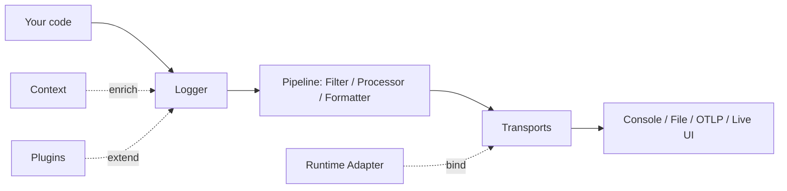

# Introduction

`lograil` is a high-performance, secure logging library for **Electron** (main + renderer), **Node.js**, and the **Web**. It gives you one zero-config `logger` that auto-detects its runtime, plus a layered pipeline of filters, processors, formatters, and transports you can extend as needed.

This page explains what `lograil` is, why it exists, when to reach for it, and the core concepts you'll meet throughout the guides. If you just want to start logging, jump to [Getting Started](./getting-started).

## Why lograil

Most logging libraries treat Electron as an afterthought: you wire up IPC by hand, duplicate config across processes, and hope the renderer's logs actually reach a file. `lograil` is built for that reality from the ground up:

- **One logger, every runtime.** The same `import { logger } from 'lograil'` works untouched in the main process, the renderer, Node, and the browser. The runtime adapter detects where it runs and binds to the right transport automatically.
- **Secure by default in Electron.** Renderer logs are forwarded to the main process over IPC — they never touch the filesystem from an untrusted context. This fits Electron's `contextIsolation` + preload security model (see [Electron](./runtime-electron)).
- **Structured, not stringly-typed.** Every log is a frozen `LogEntry` carrying a level, message, timestamp, context, and arbitrary structured fields. Transports can render it as JSON, a console line, or a live UI without re-parsing.
- **Composable pipeline.** Filter → process → format → transport. Add sampling, redaction, or custom fields without forking the library.
- **Hot-path safe.** Logging never throws into your application code. A failing transport or subscriber is isolated and reported, never breaks the caller.

## When to use it

- You're building an **Electron app** and want main + renderer logs unified into files and the console without hand-rolled IPC.
- You want **structured logs** (levels, context, fields) that survive across processes and runtimes.
- You need **pluggable outputs** — files, console, OpenTelemetry, a live in-app viewer — behind a single API.
- You care about **performance and safety** in latency-sensitive code paths.

If you only need a tiny `console.log` wrapper for a Node script, `lograil` may be more than you need. For anything multi-process, multi-runtime, or production-facing, it earns its place.

## Core concepts at a glance

`lograil` is organized as a pipeline. A log moves through these stages:

- **LogEntry** — the immutable, frozen record of a single log event: `level`, `message`, `timestamp`, `context`, `fields`, and metadata. It is shared by reference (zero-copy) and must never be mutated after creation.
- **Level** — `trace` < `debug` < `info` < `warn` < `error` < `fatal`. The logger and each transport can enforce its own threshold.
- **Context** — ambient key/value data (request id, user id, session) attached automatically to every entry via async-local storage, without threading it through every call.
- **Pipeline** — the ordered chain of **filters** (drop or keep), **processors** (enrich/redact/sample), and **formatters** (turn an entry into a string or bytes) that shape each entry before it ships.
- **Transports** — the destinations: console, rotating files, OpenTelemetry (OTLP), a live in-app stream, or your own. A logger can have many.
- **Runtime adapters** — detect the environment (Electron main/renderer, Node, Web) and bind the right defaults so the same code runs everywhere.
- **Plugins** — extend the logger with cross-cutting behavior (tracing, metrics, custom hooks) without touching core.

These concepts are explored in depth in [Architecture](./architecture). The [API Reference](/api/) documents every type and method.

## Next steps

- [Getting Started](./getting-started) — install and emit your first structured logs.
- [Configuration](./configuration) — levels, pipeline, and transports.
- [Transports](./transports) — built-in and custom destinations.
- [Electron](./runtime-electron) — secure main/renderer logging setup.
