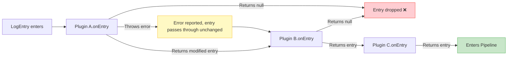

# Plugins

Plugins extend the logger through optional lifecycle hooks. Every hook is
optional; a plugin that wants to transform entries implements `onEntry`.

```ts
interface Plugin {
  /** Unique plugin name. */
  readonly name: string;
  onInit?(ctx: PluginContext): void | Promise<void>;
  onEntry?(entry: LogEntry): LogEntry | null | Promise<LogEntry | null>;
  onTransport?(transport: Transport): void;
  onDestroy?(): void | Promise<void>;
}
```

Return `null` from `onEntry` to **drop** an entry; return a (possibly new)
entry to pass it downstream.

## Registering a plugin

```ts
import { createLogger } from 'lograil';

const log = createLogger();

await log.use({
  name: 'add-host',
  onEntry(entry) {
    entry.metadata = { ...entry.metadata, host: os.hostname() };
    return entry;
  },
});
```

## PluginContext

`onInit` receives a `PluginContext` — the bridge that lets a plugin reconfigure
the logger at runtime:

```ts
interface PluginContext {
  addTransport(transport: Transport): void;
  removeTransport(name: string): void;
  pipeline: Pipeline; // add/remove filters & processors, change formatter
  use(plugin: Plugin): Promise<void>;
  unregisterPlugin(name: string): void;
  logger: Logger;
}
```

Example — a plugin that adds a redacting processor and a sampling filter:

```ts
import { createRedactProcessor, createLevelFilter, type Filter } from 'lograil';

// Keep roughly 10% of entries (random sampling).
const sampleFilter: Filter = () => Math.random() < 0.1;

log.use({
  name: 'secure',
  onInit(ctx) {
    ctx.pipeline.addProcessor(createRedactProcessor(['password', 'token']));
    ctx.pipeline.addFilter(sampleFilter);
    ctx.pipeline.addFilter(createLevelFilter(20)); // keep debug and above
  },
});
```

## Lifecycle

Plugins participate in the log production and teardown process through four
optional lifecycle hooks.

### Overview

```mermaid
flowchart TB
  subgraph Registration["Registration Phase"]
    A["logger.use(plugin)"] --> B["Check for duplicate plugin name"]
    B --> C["Store plugin in Map"]
    C --> D["Increment entryInterceptors if onEntry exists"]
    D --> E["await plugin.onInit(ctx)"]
  end

  subgraph EntryHotPath["Runtime: Every Log Entry"]
    F["logger.info('msg')"] --> G["Pipeline.process(entry)"]
    G --> H{"Has onEntry plugins?"}
    H -- Yes --> I["PluginManager.intercept(entry)"]
    I --> J["Iterate plugins in registration order"]
    J --> K{"Current plugin has onEntry?"}
    K -- Yes --> L["await plugin.onEntry(entry)"]
    L --> M{"Returns null?"}
    M -- Yes --> N["Drop entry, break chain"]
    M -- No --> O["Pass return value to next plugin"]
    O --> J
    K -- No --> J
    H -- No --> P["Fast path: write directly to transports"]
    I --> Q["writeToTransports(entry)"]
  end

  subgraph TransportNotify["Transport Notification"]
    R["logger.addTransport(t)"] --> S["PluginManager.notifyTransport(t)"]
    S --> T["Iterate all plugins"]
    T --> U["plugin.onTransport?.(t)"]
  end

  subgraph Destruction["Destruction Phase"]
    V{"Destruction method?"}
    V -- "unregisterPlugin(name)" --> W["Remove plugin, entryInterceptors -1"]
    W --> X["fire-and-forget: plugin.onDestroy?.()"]
    V -- "logger.destroy()" --> Y["Sequentially await all onDestroy hooks"]
    Y --> Z["Clear Map"]
  end

  style Registration fill:#e8f5e9,stroke:#4caf50
  style EntryHotPath fill:#e3f2fd,stroke:#2196f3
  style TransportNotify fill:#fff3e0,stroke:#ff9800
  style Destruction fill:#fce4ec,stroke:#f44336
```



### onEntry Interception Chain

Each log entry passes through every plugin's `onEntry` hook **in registration
order**. If a plugin returns `null`, subsequent plugins do not see the entry.



### Hook Triggers

| Hook          | When                                                            | Properties               |
| ------------- | --------------------------------------------------------------- | ------------------------ |
| `onInit`      | When the plugin is registered (via `use`)                       | Async, runs once         |
| `onEntry`     | For every entry, before the formatter                           | Async, chained in registration order |
| `onTransport` | When a transport is added (including by other plugins)          | Sync, iterates all plugins |
| `onDestroy`   | On `unregisterPlugin` or `logger.destroy()`                     | Async; fire-and-forget for single unregister |

```ts
log.unregisterPlugin('secure'); // triggers onDestroy
log.hasPlugin('secure'); // false
```

### Async behavior and error handling

- `onEntry` interception is **asynchronous** and runs serially in registration
  order.
- If a plugin's `onEntry` throws, the error is reported (via `onError`) but the
  **entry passes through unchanged** to the next plugin — a faulty plugin never
  drops or corrupts logs.
- Call `await log.flush()` / `await log.destroy()` before process exit to ensure
  all plugin work completes.
- Child loggers share the same `PluginManager` — plugins only need to be
  registered once.

## Built-in plugin: OTel trace correlation

`createOtelTracePlugin()` automatically injects the active OpenTelemetry trace and
span identifiers into each entry's `metadata` (`traceId` / `spanId`), so an
`OtlpTransport` (or any backend that reads those fields) can correlate logs with
their span — without you threading the context manually.

`@opentelemetry/api` is an **optional** peer dependency. If it isn't installed, or
no span is active, the plugin is a no-op and entries are unaffected.

```ts
import { createOtelTracePlugin } from 'lograil';

await log.use(createOtelTracePlugin());

// inside a traced operation, the active span is picked up automatically:
logger.info('handling request'); // => metadata: { traceId, spanId }
```
