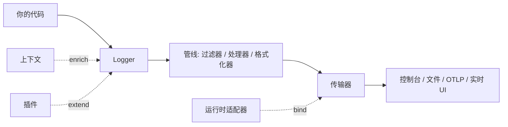

# 简介

`lograil` 是一个高性能、安全的日志库，面向 **Electron**（主进程 + 渲染进程）、**Node.js** 与 **Web**。它提供开箱即用的零配置 `logger`，可自动识别运行环境，并附带一套分层的过滤器、处理器、格式化器与传输器管线，可按需扩展。

本页介绍 `lograil` 是什么、为何存在、何时该用它，以及贯穿各篇指南的核心概念。如果你只想立刻开始记录日志，请直接跳到 [快速开始](./getting-started)。

## 为何选择 lograil

多数日志库把 Electron 当作事后补丁：你得手写 IPC、在多个进程间重复配置，还得祈祷渲染进程的日志真的能落盘。`lograil` 从一开始就为这种现实而设计：

- **一个 logger，跑遍所有运行时。** 同样的 `import { logger } from 'lograil'` 在主进程、渲染进程、Node 与浏览器中都能原样运行。运行时适配器会自动探测所处环境，并绑定正确的传输器。
- **Electron 下默认安全。** 渲染进程的日志通过 IPC 转发到主进程——它们绝不会在不受信任的上下文中触碰文件系统。这契合 Electron 的 `contextIsolation` + preload 安全模型（见 [Electron](./runtime-electron)）。
- **结构化，而非字符串拼接。** 每条日志都是一个被冻结的 `LogEntry`，携带级别、消息、时间戳、上下文与任意结构化字段。传输器可将其渲染为 JSON、控制台行或实时 UI，无需重新解析。
- **可组合的管线。** 过滤 → 处理 → 格式化 → 传输。无需 fork 库即可加入采样、脱敏或自定义字段。
- **热路径安全。** 日志调用绝不会向你的业务代码抛出异常。某个传输器或订阅者出错会被隔离并上报，绝不会中断调用方。

## 何时使用

- 你正在构建 **Electron 应用**，希望主进程与渲染进程的日志统一写入文件和控制台，而无需手写 IPC。
- 你需要 **结构化日志**（级别、上下文、字段），且要能跨进程、跨运行时保留。
- 你需要 **可插拔的输出**——文件、控制台、OpenTelemetry、应用内实时视图——统一在单一 API 之后。
- 你在意 **性能与安全**，尤其是在延迟敏感的热路径上。

如果你只是给 Node 脚本加一个极简的 `console.log` 封装，`lograil` 可能超出所需。但对于任何多进程、多运行时或面向生产的环境，它都物有所值。

## 核心概念一览

`lograil` 以管线方式组织。一条日志会依次经过以下阶段：

- **LogEntry** —— 单条日志事件的不可变、冻结记录：`level`、`message`、`timestamp`、`context`、`fields` 及元数据。它以引用方式共享（零拷贝），创建后绝不可修改。
- **Level** —— `trace` < `debug` < `info` < `warn` < `error` < `fatal`。logger 与每个传输器都可设置各自的阈值。
- **Context** —— 通过异步本地存储自动附加到每条日志的环境键值数据（请求 id、用户 id、会话），无需在每次调用中层层传递。
- **Pipeline** —— 有序的 **过滤器**（丢弃或保留）、**处理器**（ enrichment/脱敏/采样）与 **格式化器**（将日志条目转为字符串或字节）链，在日志发出前对其进行塑形。
- **Transports** —— 目的地：控制台、滚动文件、OpenTelemetry（OTLP）、应用内实时流，或你自定义的传输器。一个 logger 可拥有多个。
- **运行时适配器** —— 探测环境（Electron 主/渲染进程、Node、Web）并绑定正确的默认值，使同一份代码处处可运行。
- **插件** —— 以横切方式扩展 logger（链路追踪、指标、自定义钩子），而无需改动核心。

这些概念在 [架构](./architecture) 中有更深入的阐述。[API 参考](/zh/api/) 记录了每个类型与方法。

## 下一步

- [快速开始](./getting-started) —— 安装并发出你的第一条结构化日志。
- [配置](./configuration) —— 级别、管线与传输器。
- [传输器](./transports) —— 内置与自定义目的地。
- [Electron](./runtime-electron) —— 安全的主/渲染进程日志配置。
