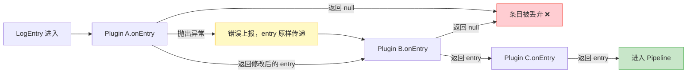

# 插件

插件通过可选的生命周期钩子来扩展 logger。所有钩子都是可选的；若插件需要转换条目，实现 `onEntry` 即可。

```ts
interface Plugin {
  /** 唯一插件名。 */
  readonly name: string;
  onInit?(ctx: PluginContext): void | Promise<void>;
  onEntry?(entry: LogEntry): LogEntry | null | Promise<LogEntry | null>;
  onTransport?(transport: Transport): void;
  onDestroy?(): void | Promise<void>;
}
```

在 `onEntry` 中返回 `null` 即可 **丢弃** 一条条目；返回（可能是新的）条目则继续往下传递。

## 注册插件

```ts
import { createLogger } from 'lograil';

const log = createLogger();

await log.use({
  name: 'add-host',
  onEntry(entry) {
    entry.metadata = { ...entry.metadata, host: os.hostname() };
    return entry;
  },
});
```

## PluginContext

`onInit` 会收到一个 `PluginContext`——它是一座桥梁，让插件能够在运行时重新配置 logger：

```ts
interface PluginContext {
  addTransport(transport: Transport): void;
  removeTransport(name: string): void;
  pipeline: Pipeline; // 添加/移除过滤器与处理器，更换格式化器
  use(plugin: Plugin): Promise<void>;
  unregisterPlugin(name: string): void;
  logger: Logger;
}
```

示例——一个同时添加脱敏处理器与采样过滤器的插件：

```ts
import { createRedactProcessor, createLevelFilter, type Filter } from 'lograil';

// 仅保留约 10% 的条目（随机采样）。
const sampleFilter: Filter = () => Math.random() < 0.1;

log.use({
  name: 'secure',
  onInit(ctx) {
    ctx.pipeline.addProcessor(createRedactProcessor(['password', 'token']));
    ctx.pipeline.addFilter(sampleFilter);
    ctx.pipeline.addFilter(createLevelFilter(20)); // 保留 debug 及以上
  },
});
```

## 生命周期

插件通过四个可选的生命周期钩子参与日志的生产与销毁过程。

### 总览

```mermaid
flowchart TB
  subgraph Registration["注册阶段"]
    A["logger.use(plugin)"] --> B["检查插件名是否重复"]
    B --> C["存储插件到 Map"]
    C --> D["若实现 onEntry 则计数 +1"]
    D --> E["await plugin.onInit(ctx)"]
  end

  subgraph EntryHotPath["运行时：每条日志"]
    F["logger.info('msg')"] --> G["Pipeline.process(entry)"]
    G --> H{"有 onEntry 插件？"}
    H -- 是 --> I["PluginManager.intercept(entry)"]
    I --> J["按注册顺序遍历插件"]
    J --> K{"当前插件有 onEntry？"}
    K -- 是 --> L["await plugin.onEntry(entry)"]
    L --> M{"返回 null？"}
    M -- 是 --> N["丢弃条目，终止链条"]
    M -- 否 --> O["将返回值传给下一个插件"]
    O --> J
    K -- 否 --> J
    H -- 否 --> P["快速路径：直接写入传输器"]
    I --> Q["writeToTransports(entry)"]
  end

  subgraph TransportNotify["传输器通知"]
    R["logger.addTransport(t)"] --> S["PluginManager.notifyTransport(t)"]
    S --> T["遍历所有插件"]
    T --> U["plugin.onTransport?.(t)"]
  end

  subgraph Destruction["销毁阶段"]
    V{"销毁方式？"}
    V -- "unregisterPlugin(name)" --> W["移除插件、entryInterceptors -1"]
    W --> X["fire-and-forget: plugin.onDestroy?.()"]
    V -- "logger.destroy()" --> Y["依次 await 所有插件的 onDestroy"]
    Y --> Z["清空 Map"]
  end

  style Registration fill:#e8f5e9,stroke:#4caf50
  style EntryHotPath fill:#e3f2fd,stroke:#2196f3
  style TransportNotify fill:#fff3e0,stroke:#ff9800
  style Destruction fill:#fce4ec,stroke:#f44336
```



### onEntry 拦截链详解

每个日志条目会按**注册顺序**依次经过所有插件的 `onEntry` 钩子。若某个插件返回 `null`，后续插件不会收到该条目。



### 钩子触发时机

| 钩子          | 触发时机                                              | 特性                     |
| ------------- | ----------------------------------------------------- | ------------------------ |
| `onInit`      | 插件被注册时（通过 `use`）                             | 可异步，仅执行一次       |
| `onEntry`     | 对每条条目，在格式化之前                               | 可异步，按注册顺序链式执行 |
| `onTransport` | 有传输器被添加时（包括被其他插件添加）                | 同步，遍历所有插件       |
| `onDestroy`   | 调用 `unregisterPlugin` 或 `logger.destroy()` 时      | 可异步，单个注销为 fire-and-forget |

```ts
log.unregisterPlugin('secure'); // 触发 onDestroy
log.hasPlugin('secure'); // false
```

### 异步与错误处理

- `onEntry` 的拦截是**异步**的，且按注册顺序串行执行。
- 若某个插件的 `onEntry` 抛出异常，错误会被上报（通过 `onError`），但**条目会原样传递**给下一个插件——一个故障插件不会丢失或破坏日志。
- 在进程退出前调用 `await log.flush()` / `await log.destroy()`，以确保所有插件工作都已完成。
- 子 logger 与父级共享同一个 `PluginManager`，插件只需注册一次。

## 内置插件：OTel trace 关联

`createOtelTracePlugin()` 会自动把当前活跃的 OpenTelemetry trace 与 span 标识注入到每条条目的 `metadata`（`traceId` / `spanId`）中，这样 `OtlpTransport`（或任何读取这两个字段的后端）就能把日志与其 span 关联起来——而无需你手动透传上下文。

`@opentelemetry/api` 是**可选的**对等依赖。若未安装，或当前没有活跃 span，该插件即为空操作，条目不受影响。

```ts
import { createOtelTracePlugin } from 'lograil';

await log.use(createOtelTracePlugin());

// 在已追踪的操作内部，活跃 span 会被自动拾取：
logger.info('handling request'); // => metadata: { traceId, spanId }
```
